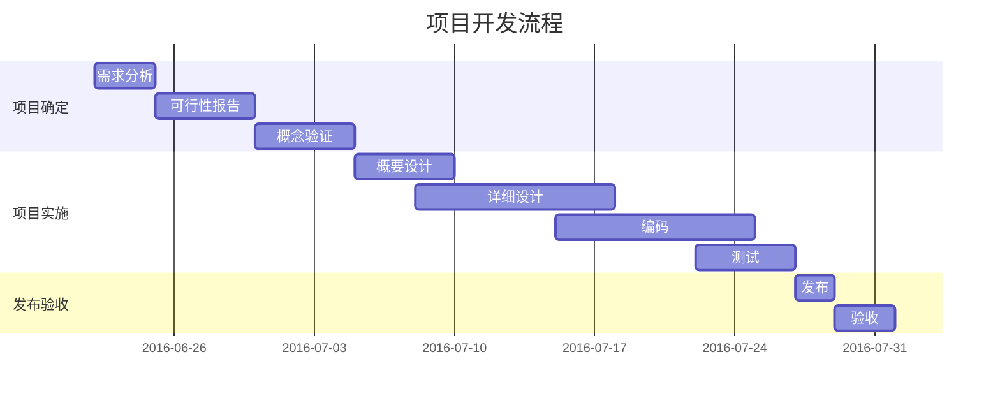
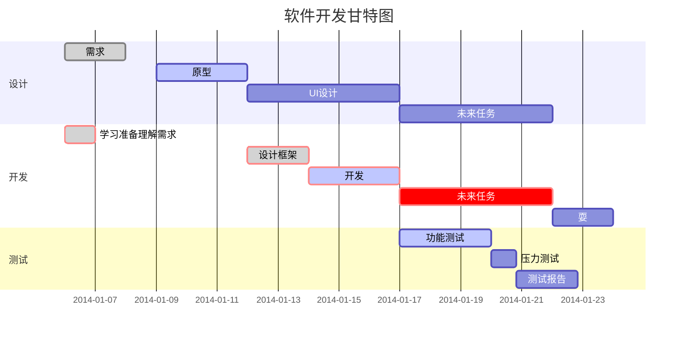

这是一段代码 `

```
var test='aaa'
```

 var test=‘aaa’


``` java code ```


`行内代码`


```mermaid
    gantt
    title 项目开发流程
    section 项目确定
        需求分析       :a1, 2016-06-22, 3d
        可行性报告     :after a1, 5d
        概念验证       : 5d
    section 项目实施
        概要设计      :2016-07-05  , 5d
        详细设计      :2016-07-08, 10d
        编码          :2016-07-15, 10d
        测试          :2016-07-22, 5d
    section 发布验收
        发布: 2d
        验收: 3d
```

```mermaid
    gantt
    title 项目开发流程
    section 项目确定
        需求分析       :a1, 2016-06-22, 3d
        可行性报告     :after a1, 5d
        概念验证       : 5d
    section 项目实施
        概要设计      :2016-07-05  , 5d
        详细设计      :2016-07-08, 10d
        编码          :2016-07-15, 10d
        测试          :2016-07-22, 5d
    section 发布验收
        发布: 2d
        验收: 3d
```


```mermaid

%% 语法示例

    gantt

    dateFormat YYYY-MM-DD

    title 软件开发甘特图


    section 设计

    需求           :done,  des1, 2014-01-06,2014-01-08

    原型           :active, des2, 2014-01-09, 3d

    UI设计           :     des3, after des2, 5d

  未来任务           :     des4, after des3, 5d


    section 开发

    学习准备理解需求           :crit, done, 2014-01-06,24h

    设计框架               :crit, done, after des2, 2d

    开发                 :crit, active, 3d

    未来任务               :crit, 5d

    耍                  :2d

  

    section 测试

    功能测试               :active, a1, after des3, 3d

    压力测试                :after a1 , 20h

    测试报告                : 48h

```