# Flink-尚硅谷-2022版

> Flink教程 尚硅谷
> https://www.bilibili.com/video/BV133411s7Sa/


## P1 Flink课程简介

#### Flink的特点
- 高吞吐量
- 低延迟
- 结果正确


#### 课程内容
- 基础篇
  - 

- 核心篇
  - DataStream API
  - 

- 高阶篇
  - 7 处理函数
  - 8 多流转换
- 扩展篇
  - 12 Flink ZEP


#### 课程特色
- 基于Flink 1.13 版本
- 基于Java语言
- 大量的代码实现
- 电商应用场景案例
- 教材：剑指大数据 摘要

资料获取方式
- B栈免费


课程基础要求
- 熟悉Java语言
- 熟悉Linux常用命令
- 熟悉Idea开发工具

##  Flink流式处理简介
> 初识Flink
> 
> 
对标Spark 处理框架

区别
- Spark 做批处理
- Flink做流处理

主要内容
- Flink是什么
- 为什么要用Flink
- 流处理的发展和演变
- Flink的主要特点
- Flink vs Spark Streaming


#### Flink是什么
Apache Flink is aframework and distributed processing engin for stateful computions over
Apache Flin世界框架和分布式处理引擎，用于对无解和有界数据流进行状态计算

#### Flink发展时间线
- 14年 第一个不能把0.6发布 ,核心开发者创建DataArtisans公司
- 14年12月 完成孵化
- 15年4月 发布里程碑式的版本0.9.0
- 19年1月 阿里巴巴收购Data Artisans公司
- 19年8月 阿里巴巴将内部Blink开源 合并如Flink1.9.0版本

扩展
- 小松鼠 快速并且灵活的大数据流处理 ，快速响应
- Flink德语 表示快速灵巧

官网地址
> http://flink.apache.org
> 数据量上的有状态计算

#### Flink框架处理流程

- 事件驱动型的应用
- 流处理的刘淑霞
- 流&批数据分析


#### Flink的应用场景
- 电商和市场营销
  - 实时报表
  - 广告投放
  - 实施推荐
- 物联网
  - 实时数据采集
  - 实时报警
- 物流配送及服务
  - 钉钉状态跟踪
  - 信息推送
- 银行和金融业
  - 实时结算
  - 风险检测
  - 交易行为风险检测

#### 为什么要用Flink
- 批处理和流处理
- 流数据更真实地反应了我们的生活方式
- 我们的目标
  - 低延迟
  - 高吞吐
  - 结果的准确性和良好的容错性


传统数据处理架构
- 事务处理 OLTP

- 分析处理 OLAP

Storm 第一代流式处理计算框架


#### 流处理的发展和演变
- lambda架构
  - 用两套系统，同时保证低延迟和结果准确
  - 缺点：同时维护批处理和流处理两套架构
##### 第三代 流处理器Flink

#### Flink的主要特点
Flink核心特点
- 高吞吐
- 结果的准确性
- 精确一次exactly-once的状态一致性保证

#### Flink的应用模型 应用场景
- 事件驱动型应用
  - 连接Kafka
- 数据分析型应用

- 数据管道型应用
  - ETL（提取-转换-加载） 
  - 数据管道与ETL作业向上，都可以转换数据 并将其存储系统移动到另一个
  - 区别：数据管道是以持续流模式运行，而非周期性触发，支持从一个不断生成数据的源头触发，并将其以低延迟移动到终点
  - 例如：监控新的日志文件 写入事件日志；将事件流物化到数据库或增量构建和优化查询索引。


#### 分层API
- SQL 最高层语言
- Table API声明式领域专用语言
- DataStream/DataSet API 核心APIs
- 有状态流处理 底层APIs

Flink分层特点：
- 越顶层越抽象，表达含有越简明，使用越方便
- 越底层越具体，表达能力越丰富，使用越灵活


#### Flink vs Spark Streaming
Spark主要提出了内存计算
Spark Streaming 流式计算
Spark 

数据处理架构：
Spark是基于批处理
Spark streaming也是基于批处理的
将数据流进行截取，批次执行，将流切分为 足够小的批
Flink 

有界数据  无界数据

#### 数据模型
- Spark采用RDD模型，spark streaming的DStream 实际上也就是一组组小批数据RDD的集合
- Flink基本数据模型师数据流，以及事件Event序列

#### 运行时架构
- Spark


## 第2章 Flink快速上手
同时支持Java和Scala API
使用Idea作为开发工具
使用Maven作为包管理工具
示例：分词 词频统计


### 2.1 环境准备
- windows10
- Java8
- IDEA
- Maven
- Git
- Flink版本 1.13.0

### 2.2 创建项目

项目名称: FlinkTutorial


##### 相关依赖
```shell
flink 1.13.0
日志管理
log4j 
sel4j  1.7.30
```

指定版本


scala.版本 2.12

flink-java
flink-streaming-java
flink-clients_${version}


```pom
<?xml version="1.0" encoding="UTF-8"?>
<project xmlns="http://maven.apache.org/POM/4.0.0"
         xmlns:xsi="http://www.w3.org/2001/XMLSchema-instance"
         xsi:schemaLocation="http://maven.apache.org/POM/4.0.0 http://maven.apache.org/xsd/maven-4.0.0.xsd">
    <modelVersion>4.0.0</modelVersion>

    <groupId>com.beyond</groupId>
    <artifactId>flink-tutorial</artifactId>
    <version>1.0.0</version>
    <description>Flink-Demo 分词 </description>

    <properties>
        <java.version>1.8</java.version>
        <flink.version>1.13.0</flink.version>
        <scala.binary.version>2.12</scala.binary.version>
        <sl4j.version>1.7.30</sl4j.version>
    </properties>

    <dependencies>
        <dependency>
            <groupId>org.apache.flink</groupId>
            <artifactId>flink-java</artifactId>
            <version>${flink.version}</version>
        </dependency>

        <dependency>
            <groupId>org.apache.flink</groupId>
            <artifactId>flink-streaming-java_${scala.binary.version}</artifactId>
            <version>${flink.version}</version>
        </dependency>

        <dependency>
            <groupId>org.apache.flink</groupId>
            <artifactId>flink-clients_${scala.binary.version}</artifactId>
            <version>${flink.version}</version>
        </dependency>

        <dependency>
            <groupId>org.slf4j</groupId>
            <artifactId>slf4j-api</artifactId>
            <version>${sl4j.version}</version>
        </dependency>

        <dependency>
            <groupId>org.slf4j</groupId>
            <artifactId>slf4j-log4j12</artifactId>
            <version>${sl4j.version}</version>
        </dependency>

        <dependency>
            <groupId>org.apache.logging.log4j</groupId>
            <artifactId>log4j-to-slf4j</artifactId>
            <version>2.14.0</version>
        </dependency>
    </dependencies>
</project>
```

DataSet API 弃用

使用DataStream API 做批处理任务，需要在提交任务时，  运行时的提交模式改为 BATCH，


### 2.3.2 流处理
Data Stream API批流统一，

两种不同的流数据
- 批处理 有界流
- 流处理 无界流

并行度 默认是当前电脑的CPU的核心数 16核 1-16


### 无界流处理WordCount
使用netcat //linux 执行 nc命令 在7777 端口进行输出 
```bash
nc -lk 7777
```

##### 修改硬编码的主机名和端口号 为外部参数传入

```java
public static void main(String[]args){
  ParameterTool parameterTool = ParameterTool.fromArgs(args);
  String hostname = parameterTool.get("host");
  Integer port parameterTool.get("port");
  }
```
Idea 运行时, 配置Program arguments
```java
--host hadoop02 --port 7777
```


## 第3章 Flink部署

开发环境中 由引入的jar包 模拟了一个集群环境

关键组件
- 客户端Client
- 作业管理器 JobManager
- 任务管理器 TaskManager


我们的代码由客户端进行获取和转换，


### 3.1 快速启动一个Flink集群
#### 3.1.1 环境配置
三台Linux机器
- CentOS7.5
- Java8
- 安装Hadoop集群 建议2.7.5  为了使用Yarn的调度 扩充TaskManager节点
- 节点1 192.168.10.102 名为hadoop102
- 节点2 192.168.10.103 名为hadoop103
- 节点3 192.168.10.104 名为hadoop104


#### 3.1.2 本地启动
最简单的方式 不搭建集群  本地启动
flink-1.13.2-scale_2.12.tgz


flink-conf.yaml
```yaml
jobmanager.rpc.address: hadoop102
jobmanager.rpc.port: 6123

jobmanager.

taskmanager.numberOftaskSlots: 1 #任务槽 默认1
parallelism.default: 1 # 并行度1

## 高可用配置

## Fault 容错配置检查点

##
```
###### masters 
cat masters


###### workers
cat conf/workers

启动
```shell
cd flink-1.13.0
bin/start-cluster.sh

jps 

```
start-cluster
stop-cluster

#### 集群部署
集群节点的角色
JobManager hadoop102
TaskManager hadoop103
TaskManager hadoop104


修改集群配置
- 修改conf/flink-conf.yaml文件 修改 jobmanager.rpc.address 为hadoop102
- 修改works文件 将另外两天节点服务器添加为当前Flink集群的TaskManager节点


web-ui
> http://hadoop102:8081/


##### TaskManagers
##### JobManager
##### Submit New Job 作业信息


#### 3、向集群提交作业
Add New  上传jar包

打包工具 maven-assembly-plugin
```pom
<build>
  <plugins>
    <plugin>
    <groupId>org.apache.maven.plugins</groupId>
      <artifactId>maven-assembly-plugin</artifactId>
      <configuration>
          <!--   这个是assembly 所在位置；${basedir}是指项目的的根路径  -->
          <descriptors>
              descriptor>${basedir}/src/main/assembly/assembly.xml</descriptor>
          </descriptors>
          <!--打包解压后的目录名；${project.artifactId}是指：项目的artifactId-->
          <finalName>${project.artifactId}</finalName>
          <!-- 打包压缩包位置-->
          <outputDirectory>${project.build.directory}/release</outputDirectory>
          <!-- 打包编码 -->
          <encoding>UTF-8</encoding>
      </configuration>
      <executions>
        <execution><!-- 配置执行器 -->
            <id>make-assembly</id>
            <phase>package</phase><!-- 绑定到package生命周期阶段上 -->
            <goals>
                <goal>single</goal><!-- 只运行一次 --> 
            </goals>
        </execution>
    </executions>

    </plugin>
  </plugins>
</build
```

上传jar包

指定运行参数
- 指定入口类
- Parallelism: 并行度
- Program Arguments 运行参数
- Savepoint Path 保存点
- Show Plan 显示执行计划
  - 并行度 部分操作的并行度 是无法调高的 ，例如读取流的操作
- 提交任务

- 任务失败 查看log
  - 连接失败， nc 并未启动
  - 没有输出 nc中 需要输入 文本 
- 执行结果
  - JobManager Stdout 控制台
  - TaskManager Stdout 控制台 输出到 TaskManager 是Worker 真正执行的服务
- 停止任务
  - Cancel Job 按钮

#### 命令行 方式 进行任务提交

先上传jar包 ftp上传到hadoop102
```shell

# 在本机执行
./bin/flink run -c com.beyond.wordcount.StreamWordCount -p 2 ../FlinkTutorial-1.0-SNAPSHOT.jar
# 在其他服务器执行
./bin/flink run -m hadoop102:8081 -c com.beyond.wordcount.StreamWordCount -p 2 ../FlinkTutorial-1.0-SNAPSHOT.jar
```

取消任务 需要通过web页面 Cancel Job
如果再次提交 会提示 没有可用的资源，只有一个 

命令行 取消操作
```shell
./bin.flink cancel JOB-ID
```


### 3.2 部署模式
三种不同的模式
- 会话模式 Session Mod
- 单作业

#### 3.2.1 会话模式Session MOd
需要先启动一个集群，保持一个会话，在这个会话中通过客户端提交作业，

- 回话模式 比较适合于 打个规模比较小，执行时间段的大量作业

#### 3.2.2 单作业模式
会话因为资源共享会导致很多问题，索引为了更好的隔离资源，我们可以考虑为每个提交的作业启动一个集群

单作业模式


#### 3.2.3 应用模式Application Mode
前面两种模式下，应用代码都是在客户端上执行

跟单作业模式

作业与集群一对一
应用jar包 与集群一对一


### 3.3 独立模式 Standalone
独立模式 是部署Flink最基本也是最简单的方式，所需要的所有FLink组件 都只是操作系统上运行的JVM

#### 3.3.1 毁坏模式部署

#### 3.3.2 单作业模式部署
没有

#### 3.3.3 应用模式部署
 很少使用

````bash
./binstandalon-job.sh start --job-classname com.beyond.wordcount.StreamWordCount

./bin taskmanager.sh start

./bin task
````

### 3.4 YARN模式
 最常用的资源管理平台是YARN
YARN上部署的过是：客户段把Flink应用提交给Yarn的ResourceManager，Yarn的ResourceManage会项目NodeManager申请容器，在这些容器上,Flink
会部署JobManager 和TskManager


1.8之前，Flink部署在YARN上，需要Hadoop
1.8之后，Fink 需要自行下载

Flink安装目录的 lib目录下


1.11 之后 ，只需要配置环境变量


（3） 启动Hadoop集群

（4） 
```shell
./bin/yarn-session.
```

#### 3.4.1 相关准备和配置
#### 3.4.2 会话模式部署

从Flink 1.11.0版本之后 -n - 两个参数

./bin/flink run -c com.beyond.wc.Stream


#### 3.4.3 单作业模式的部署
在YARN环境中，由于有了外部平台做资源调度，所以我们可以使用直接诶想YARN 一个单独的作业，从而启动一个Flink
集群
（1）执行命令提交作业
樱花园模式同样


#### 3.4.4 应用模式部署


### 3.5 K8S模式

容器化不是事如今业界


## 第4章 Flink运行时架构
- 系统架构
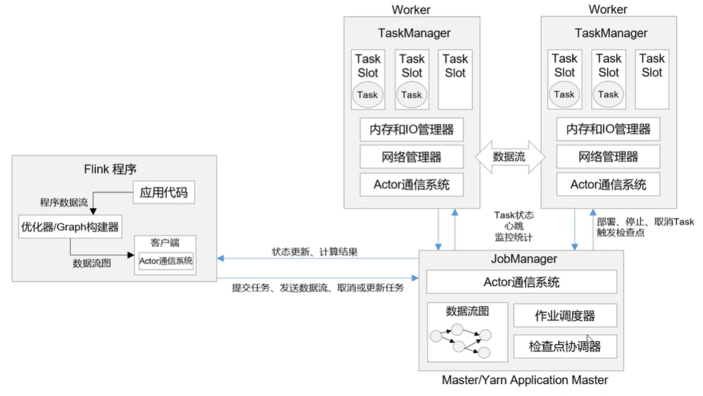
- 作业提交流程
- 


作业管理器JobManage
控制一个应用程序的主进程，是Flink集群中任务管理和调度的核心
- Jobmaster
  - JobMaster是JobManager最核心的组件，负责处理单独的作业Job
  - 在作业提交时，JobMaster会现接受到要执行应用，一般是由客户端提价来的，包括：Jar包，数据流图dataflow graph 和作用和图JobGraph
  - JobMaster 回吧JobGraph转换为换一个物理层面的数据流图，这个图呗叫做执行图
- 资源管理器ResourceManager
  - ResourceManager主要负责资源的分配和关联，在Flink集群中只有一个，所谓 资源 主要是指TaskManager的任务槽 task slots 。任务槽就是Flink集群中的资源调配单元，包含了机器用来执行计算的一组CPU和内存资源。每一个任务Task都要分配到一个slot上执行。
- 分发器Dispatcher


任务管理Taskmanaager
- Flink中的工作进程，通常自带Flink中会有多个TaskManger运行，每一个TaskManager都包含了一定数量的插槽
- 启动了


##### 作业提交流程
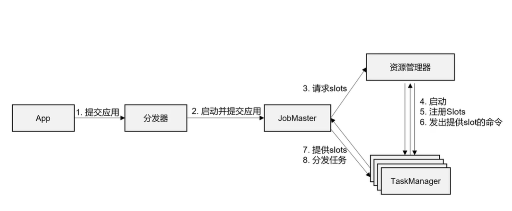
概括的提交流程 
比较抽象的提交流程 ，不考虑提交模式的情况下

Standalone 模式作业提交流程
会话模式的提交流程

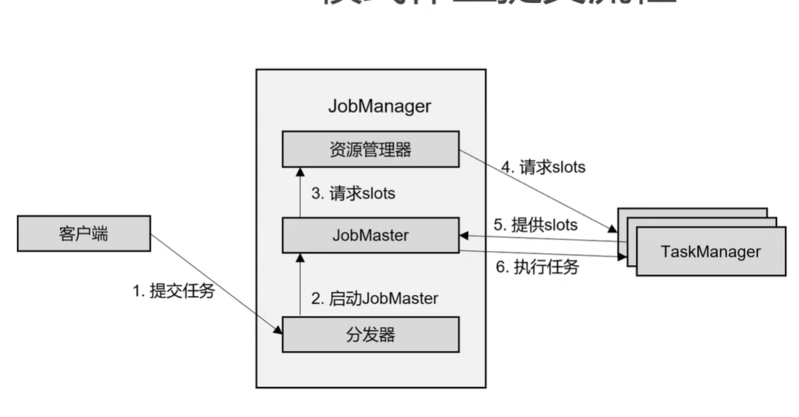

YARN会话模式作业提交流程

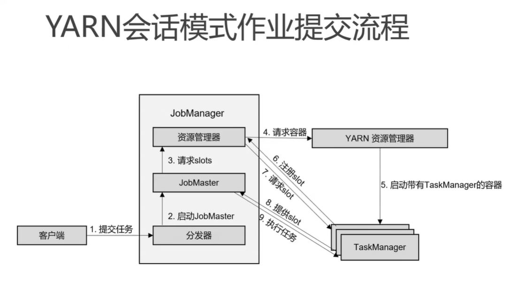

数据流图
程序与数据流 DataFlow
- 所有的Flink程序都是由三部分组成 Source Transformation 和Sink
- Source负责读取 
- 在运行时，Flink上运行的程序会被映射成 逻辑数据流 dataflows ,它包含了这三部分，
- 每一个dataflow以一个或多个
- 


##### 并行度 Parallelism
- 每一个算子operator 可以包含一个或多个子任务operator subtask,这些子任务在不同的现场、不同的物理机或者不同的容器中完全独立地执行。
- 一个特定算子的子任务subtask的个数被称之为其并行度parallelism.setParallelism()  例如 flatMap()方法 env.setParallelism(),sum().setParallelism()
  - 代码里的并行度设置，优先于全局的并行度设置
  - 不提倡在代码里设置全局并行度 硬编码方式
  - 可以在webUI中作业提交时设置 执行参数中设置 -P 
  - 如果都没有 可以查看 配置文件flink.yaml中的默认设置parallelism.default

##### 数据传输形式
- 一个程序中，不同的算子可能具有不同的并行度
- 算子直接阐述数据的形式可以是one-to-one(forwarding)的模式
- 


##### 算子链 Operator Chains

前后发生的有数据两个算子 如果本身的操作都是one-to-one操作，并行度一致的话 ，可以河北
- Flink采用了一种称为任务链的优化技术，客户在特定条件下减少本地通信的开销。为了满足任务链的要求， 必须将两个或多个算子设置为相同的并行度，并且通过本地转发Local Forward的方式进行连接
- 相同并行度的one-to-one操作，FLink这样想了的算子链接在一起形成一个task，原来的算子称为里面的subtask
- 并行度相同，并且是one-to-ooe操作，两个条件缺一不可


##### 执行图ExecutionGraph
- Flink中的执行图可以分为四层：StreamGraph-> JobGraph -> ExecutionGraph -> 物理执行图
- StreamGraph 是根据用户通过Stream API编写的代码生成的最初的图。用来标识程序的拓扑结构
- JobGraph：StringGraph经过优化后生成了JobGraph，提交给JobManager的数据结构。主要的优化为，将多个符合条件的节点chain在一起作为一个节点
- ExecutionGraph：JobManager根据JpbGraph生成ExecutionGraph
- 执行物理图：JobManager根据ExecutionGraph对Job进行调度后，在各个TaskManager上部署Task后形成的“图”，并不是一个具体的数据结构。

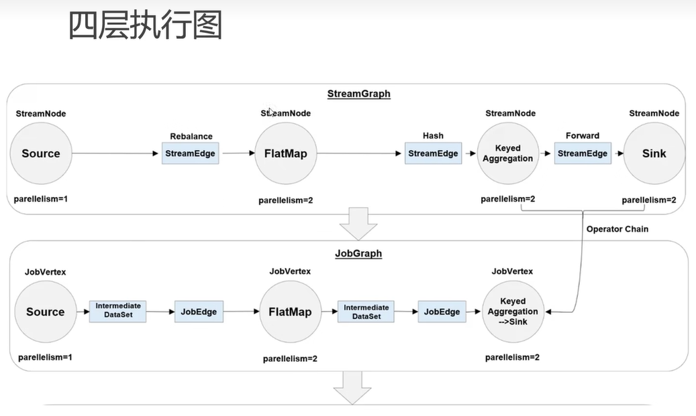

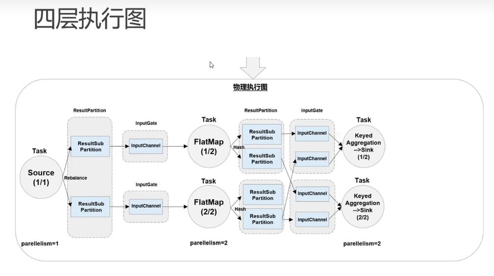


##### 任务Task和任务槽Task Slots
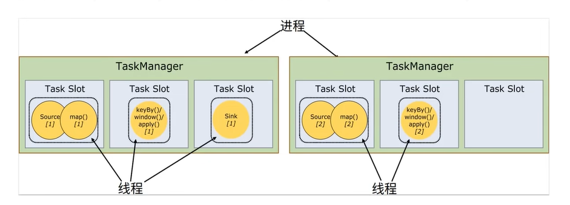
- Flink中每一个TaskManager都是一个JVM进程，他可能会在独立地现场上执行一个或多个子任务
- 为了控制一个TaskManager能接受多少个Task，TaskManager通过task slot来进行控制（一个TaskManager至少有一个slot）
- 推荐：按CPU的核心数配置任务槽的数量，每个核心处理不同的任务

##### 任务共享Slot
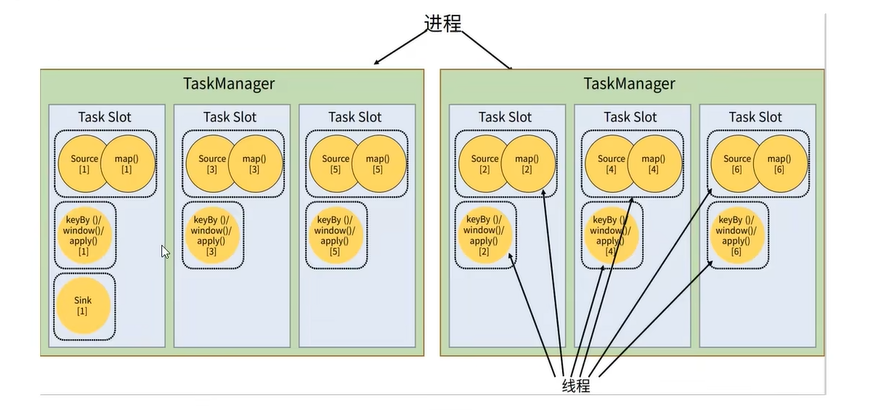
- 默认情况下，Flink允许子任务共享slot。这样的结果是，一个slot可以保存作业的整个管道。
- 当我们将资源密集型和非密集想的任务同事放到一个slot中，他们就可以自行分配对资源占用的比例，从而保证最重的子任务分配给所有的TaskManager

##### Slot和并行度
- 任务槽Task Slot
  - 静态概念，是指TaskManager具有的并发执行能力
  - 通过参数taskmanager.numberOfTaskSlots进行配置
- 并行度（Parallelism）
  - 动态概念，也就是TaskManager运行程序时实际使用的并发能力
  - 通过参数parallelism.default进行配置

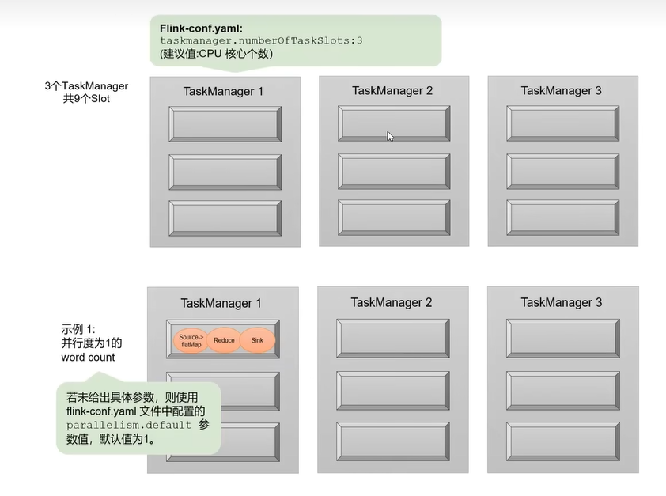

设置之后，后面的算子默认都是与之前的设置保持一致


## 第5章 DataStream API（基础篇）


程序流程
- 获取执行环境（execution environment）
- 读取数据源（source）
- 定义基于数据的转换操作： 分组、求和
- 定义计算结果的输出位置（sink）：打印操作
- 基于环境，触发程序启动执行

其中，获取环境和触发执行，都可以认为是对执行环境的操作。 所以这里我们从执行环境Execution Environment、数据源Source、转换操作Transformation、输出Sink四大部分，对常用的DataSetAPI做基本介绍

### 5.1 执行环境 Execution Environment

#### 5.1.1 创建执行环境

有三种
##### getExecutionEnvironment 
最简单的方式是直接调用getExecutionEnvironment方法，它UI根据当前的运行的上下文直接打得到正确的结果，如果陈谷是独立运行的，就返回一个本地的执行环境；如果是黄金了jar包，然后从命令行调用它并提交到集群执行，难免就返回集群的执行环境，。也就是说，这个方法会根据当前的运行方式，自行觉得该返回什么样的运行环境
```java
StreamExecutionEnvironment env = StreamExecutionEnvironment.getStreamExecutionEnvironment();

```

##### createLocalEnvironment
返回一个本地执行环境，可以在调用时传入一个参数，指定默认的并行度；如果不指定，则默认的并行度就是本机CPU的核心数

##### createRemoteEnvironment 
返回集群的执行环境，需要调用时指定JobManager的注解名和端口号，并指定要在集群中运行的Jar包

#### 5.1.2 执行模式Execution Mod
Flink中有 批处理模式 和 流处理模式，默认情况下下使用StreamExecutionEnvironment.getExecutionEnvironment() 串讲
单独配置
从1.12.0版本开始，Flink实现了API上的流批统一，DataStream API新增了一个重要特性；可以支持不用的执行模式Execution Mod，通过简单的设置就可以让一段Flink程序在流处理和批处理之间切换，这样依赖，DataSet API也就没有存在的必要了。

- 流执行模式 Streaming

这是DataStream API最经典的模式，一般用于需要持续实施护理的无界数据流。默认情况下，程序使用的就是STREAMING执行模式

- 批处理模式BATCH

专门用于批处理的执行模式，这种模式下，Flink处理作业的方式类似于MapReduce框架，对于不会持续计算的有界数据，我们用这种模式处理会更方便

- 自动模式AUTOMATIC

在这种模式下，将有程序恩家数据源是否有界，来自动旋转执行模式。

##### 1、BATCH模式的配置方法
由于Flink程序时STREAMING模式，我们这里重点介绍一下BATCH模式的配置。 主要有两种方法
- （1） 通过命令行配置

```shell
bin\flink run -Dexecution.runtime-mod=BATCH
 
```
在提交作业时，怎讲execution.runtime-mod参数，指定为BATCH

- （2）通过代码配置
```java
StreamExecutionEnvironment env= StramExectionEnvironment.getExecutionEnvironment();
env.setRuntimeMod(RuntimeExecutionMode.BATCH);
```
在代码中，直接基于执行环境调用setRuntimeMode方法，传入BATCH模式。
建议：不建议直接在代码中配置， 而是使用命令行。这与并行度是类似的，在提交作业时指定参数可以更加灵活，同一段应用程序写好之后，既可以用于批处理也可以用于流处理。而在代码中硬编码Hard Code方式可扩展性比较差，一般都不推荐。

##### 2. 什么时候选择BATCH模式 
Flink本次持有的就是流处理的世界观，即使是批量数据，也可以呗看做是有界流来进行处理。索引STREAMING执行模式对于有界数据和无界数据都是有效性的；而BATCH模式仅能用于有界数据。
如果只希望通过批处理得到最终结果，这时候应该用批处理模式
总结：原则：用BATCH模式处理批量数据，用STREAMING模式处理流式数据。因为数据有界的时候，直接输出结果会更加高效；而当数据无界的时候，我们没有旋转，只能使用STREAMING模式才能处理持续的数据流

#### 5.1.3 触发程序执行


### 5.2 数据源 Source

Flink可以从各种来源获取数据，然后构建DataStream进行转换处理，一般将数据的输入来源称为数据源DataSource，而读数据的算子就是源算子Source Op


run()
cancel()


#### 5.2.1 准备工作

为了更好的理解，可以构建一个时间的应用场景，比如网站的访问操作，可以抽象成一个三元组（用户名、用户访问的URL、用户访问的URL时间戳），索引在这里，我们创建一个类Event，将用户行为包装称为一个对象，Event好好如下自动
- user String 用户名
- url String 用户访问的url
- timestamp Long 用户访问的url的时间戳

具体代码
```java
public class Event{
  public String user;//  用户名
  public String url; //  用户访问的url
  public long timestamp ; //时间戳
  
  // 无参构造
  public Evnet(){
      
  }
  
  public Event(String user,String url ,Long timestamp){
      this.user=user;
      this.url=url;
      this.timestamp=timestamp;
  }
  
  @Override
  public String toSting(){
      return "Event{"+
        "user='"+user+"\'"
    "url='"+url+"\'"
    "timestamp='"+new Timestamp(timestamp)
        + "}";
  }
  
  
}
```

需要注意的是定义的Event类，具有如下特点：
- 类是一个公用public的
- 所有的熟悉都是共有的public
- 所有属性的类型都是可以序列化的

Flink中会将这样的类作为特殊的POJO数据类型来对待，方便数据的解析和序列化。


#### 5.2.2 从集合中读取数据
#### 5.2.3 从文件读取数据

SourceTest

```java
public class SourceTest {
  public static void main(String[] args) {
    StreamExecutionEviroennt env = StreamExecutionEviroennt.getExecutionEnvironment();
    env.setParallelism(1);
    env.readTextFile();
    // 1 从文件读取数据
    DataStreamSource<String> stream = env.readTextFile("input/clicks.text");

    //2 从集合中读取数据
    ArrayList<Integer> nums = new ArrayList<>();
    nums.add(2);
    nums.add(5);
    DataStreamSource<Integer> numStream = env.fromCollection(nums);

    ArrayList<Event> events = new ArrayList<Event>();
    events.add(new Event("Mary",'/home',1000L));
    events.add(new Event("Mary",'/home',1000L));
    events.add(new Event("Lili",'/card',2000L));
    DataStreamSource<Event> stream2  = env.fromCollection(events)
    
    //从元素读取数据
    DataStreamSource<Event> stream3  = env.fromElements(
        new Event("Mary",'/home',1000L),
        new Event("Mary",'/home',1000L)
    );
    stream.print();
    stream1.print();
    stream2.print();
    stream3.print();
    
    env.execute();
  }
}
```

#### 5.2.4 从Socket读取数据
用nc命令启动 socket发送数据
```shell
nc -lk 7777
```

```java
  DataStreamSource<String> stream4  =env.socketTextStream("hadoop102",7777);
  stream3.print();
  env.execute();
```

#### 5.2.5 从Kafka读取数据

对于真正的流数据，时间项目应该怎样读取呢？
Kafka作为分布式消息传输队列，是一个高吞吐、易扩展的消息系统。而小的队列的传输方式，恰恰和流处理事完全一致的，所以可以说Kafka和Flink是天生一对，是当前数量流式数据的双子星
在入境的实时流式处理应用中，由Kafka进行数据集的收集和传输，Flink进行分析技术，这样的架构已经成为众多企业的首选

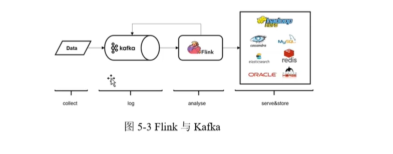

从Kafka读取数据
env.addSource(SourceFunction... );

连接器工具 
引入连接器工具
```pom
<dependency>
  <groupId>org.apache.flink</groupId>
  <artifictId>flink-connector-kafka_${scala.binary.version}</artifictId>
  <version>${flink.version}</version>
</dependency>
```
调用env.addSource(),传入FlinkKafkaConsumer的对象实例
```java
    // 5、从kafka中读取数据
    Properties Properties properties= new Properties();
    properties.setProperty("bootstrap.servers", "hadoop102:9092");  
    properties.setProperty("group.id","consumer-group");
    properties.setProperty("key.deserializer","org.apache.kafka.common.serialization.StringDeserializer");
    properties.setProperty("value.deserializer","org.apache.kafka.common.serialization.StringDeserializer");
    properties.setProperty("auto.offset.reset","latest");
    DataStreamSource<String> kafkaStream=env.addSource(new FinkKafkaConsumer<String>("clicks",
        new SimpleStringSchema(),
        new SimpleStringSchema(),properties));
    kafkaStream.print();
  
    env.execute();
```

启动kafka程序
```shell
cd /opt/module/kafka_2.11-2.1.0/
## 先启动zookeeper
./bin/zookeeper-server-strt.sh -daemon ./config/zookeeper.properties

jps

./bin/kafka-server-strt.sh -daemon ./config/server.properties

jps


## 创建生产者 同时创建topic
./bin/kafka-console-producer.sh --broker-list localhost:9092 --topic clicks

```


其他流式系统的连接器
- RabbitMQ 
- google pubsub
- Twitter Steaming API

#### 5.2.6 自定义Source

自定义数据源，实现SourceFunction接口，主要实现两个方法run() cancel()


#### 5.2.7 Flink支持的数据类型


### 5.3 转换操作 Transformation


### 5.4 输出sink


## 第6章 Flink中的事时间和窗口

## 第7章 处理函数

## 第8章 多流转换

## 第9章 状态编程

## 第10章 容错机制

## 第11章 TableAPI和 SQL

## 第12章 Flink CEP

### 12.1 什么是 CEP ？
- 复杂事件处理（Complex Event Processing，CEP）

- Flink CEP是在 Flink 中实现的复杂事件处理（CEP）库

- CEP 允许在无休止的事件流中检测事件模式，让我们有机会掌握数据中重要的部分

- 一个或多个由简单事件构成的事件流通过一定的规则匹配，然后输出用户想得到的数据 — 满足规则的复杂事件

### 12.2 CEP 的特点

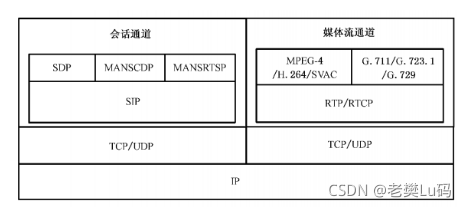

- 目标：从有序的简单事件流中发现一些高阶特征

- 输入：一个或多个由简单事件构成的事件流

- 处理：识别简单事件之间的内在联系，多个符合一定规则的简单事件构成复杂事件

- 输出：满足规则的复杂事件

### 12.3 Pattern API
- 处理事件的规则，被叫做“模式”（Pattern）

- Flink CEP 提供了 Pattern API，用于对输入流数据进行复杂事件规则定义， 用来提取符合规则的事件序列

```java
DataStream<Event> input = ... ;
// 定义一个Pattern
Pattern<Event, Event> pattern = Pattern.<Event>begin("start") .where( ...).next("middle").subtype(SubEvent.class ).where(.... followedBy("end" ) .where( .. . ) ;
// 将创建好的Pattern 应用到输入事件流上PatternStream<Event> patternStream = CEP .pattern(input, pattern);// 检出匹配事件序列，处理得到结果
DataStream<Alert> result = patternStream,select(...);
```

#### 12.3.1 模式分类
##### 个体模式（Individual Patterns）
- 组成复杂规则的每一个单独的模式定义，就是“个体模式”

  例：start.times(3).where(new SimpleCondition<Event>(){...})

##### 组合模式（Combining Patterns 也叫模式序列）
- 很多个体模式组合起来，就形成了整个的模式序列

- 模式序列必须以一个“初始模式”开始：

  例：Pattern<Event,Event> start = Pattern.<Event>begin("start");

##### 模式组（Groups of patterns）
- 将一个模式序列作为条件嵌套在个体模式里，成为一组模式

#### 12.3.2 个体模式（Individual Patterns）

- 个体模式可以包括“单例（singleton）模式”和“循环（looping）模式”
- 单例模式只接收一个事件，而循环模式可以接收多个
- 量词（Quantifier）
- 可以在一个个体模式后追加量词，也就是指定循环次数

```java
// 匹配出现 4 次
start.times(4)// 匹配出现o或4次start.times(4).optional
// 匹配出现 2，3 或 4 次
start.times(2，4)
// 匹配出现 2，3 或 4 次，并且尽可能多地重复匹配
start.times(2，4).greedy
// 匹配出现 1 次或多次
start.oneOrMore
// 匹配出现 @ 次、2 次或多次，并且尽可能多地重复匹配
start.timesOrMore(2).optional.greedy
```

##### 条件（Condition）

- 每个模式都需要指定触发条件，作为模式是否接受事件进入的判断依据

- CEP 中的个体模式主要通过调用 .where() .or() 和 .until() 来指定条件

- 按不同的调用方式，可以分成以下几类

###### 简单条件（Simple Condition）
通过 .where() 方法对事件中的字段进行判断筛选，决定是否接受该事件
```java
start.where(new SimpleCondition<Event>() [
  @Override
  public boolean filter(Event value) 
    throws Exception {
      return value.getName. startswith("foo");
    }
  });
```

###### 组合条件
将简单条件进行合并；.or() 方法表示或逻辑相连，where 的直接组合就是 AND
```java
  pattern.where(event => ... /* some condition */).or(event => ... /* or condition */ )
```
###### 终止条件
如果使用了 oneOrMore 或者 oneOrMore.optional，建议使用 .until() 作为终止条件，以便清理状态

###### 迭代条件
- 能够对模式之前所有接收的事件进行处理
- 可以调用 ctx.getEventsForPattern(“name”)

```java
  .where(new IterativeCondition<Event>() {...})
```

#### 12.3.3 组合模式（Combining Patterns 也叫模式序列）

• 严格近邻（Strict Contiguity）

– 所有事件按照严格的顺序出现，中间没有任何不匹配的事件，由 .next() 指定

– 例如对于模式”a next b”，事件序列 [a, c, b1, b2] 没有匹配

• 宽松近邻（ Relaxed Contiguity ）

– 允许中间出现不匹配的事件，由 .followedBy() 指定

– 例如对于模式”a followedBy b”，事件序列 [a, c, b1, b2] 匹配为 {a, b1}

• 非确定性宽松近邻（ Non-Deterministic Relaxed Contiguity ）

– 进一步放宽条件，之前已经匹配过的事件也可以再次使用，由 .followedByAny() 指定

– 例如对于模式”a followedByAny b”，事件序列 [a, c, b1, b2] 匹配为 {a, b1}，{a, b2}

• 除以上模式序列外，还可以定义“不希望出现某种近邻关系”：

– .notNext() —— 不想让某个事件严格紧邻前一个事件发生

– .notFollowedBy() —— 不想让某个事件在两个事件之间发生

• 需要注意：

– 所有模式序列必须以 .begin() 开始

– 模式序列不能以 .notFollowedBy() 结束

– “not” 类型的模式不能被 optional 所修饰

– 此外，还可以为模式指定时间约束，用来要求在多长时间内匹配有效

```java
  next.within(Time.seconds(10))
```

#### 12.3.4 模式的检测
• 指定要查找的模式序列后，就可以将其应用于输入流以检测潜在匹配

• 调用 CEP.pattern()，给定输入流和模式，就能得到一个PatternStream

```java
DataStream<Event> input = ...
Pattern<Event, Event> pattern = Pattern.<Event>begin("start").where( ...)...
PatternStream<Event> patternStream = CEP.pattern(input, pattern);
```
#### 12.3.5 匹配事件的提取

- 创建 PatternStream 之后，就可以应用 select 或者 flatselect 方法，从检测到的事件序列中提取事件了

- select() 方法需要输入一个 select function 作为参数，每个成功匹配的事件序列都会调用它

- select() 以一个 Map<String，List <IN>> 来接收匹配到的事件序列，其中 key 就是每个模式的名称，而 value 就是所有接收到的事件的 List 类型

```java
public OUT select(Map<String, List<IN>> pattern) throws Exception {
    IN
  } startEvent = pattern.get("start") .get(0);IN endEvent = pattern .get("end").get(0);
  return new OUT(startEvent, endEvent);
 
```

#### 12.3.5 超时事件的提取

```java
PatternStream<Event> patternStream = CEP .pattern(input, pattern);OutputTag<String> outputTag = new OutputTag<String>("side-output")(};
SingleOutputStreamOperator<ComplexEvent> flatResult =patternStream.flatSelect(
outputTag,
new PatternFlatTimeoutFunction<Event, TimeoutEvent>() [...}new PatternFlatSelectFunction<Event, ComplexEvent>() [...}
DataStream<TimeoutEvent> timeoutFlatResult =flatResult .getSideOutput(outputTag);

```
